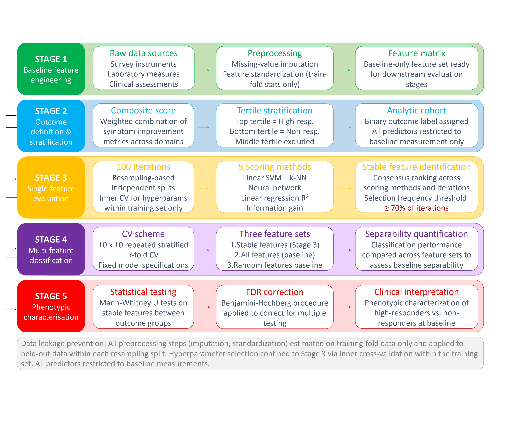
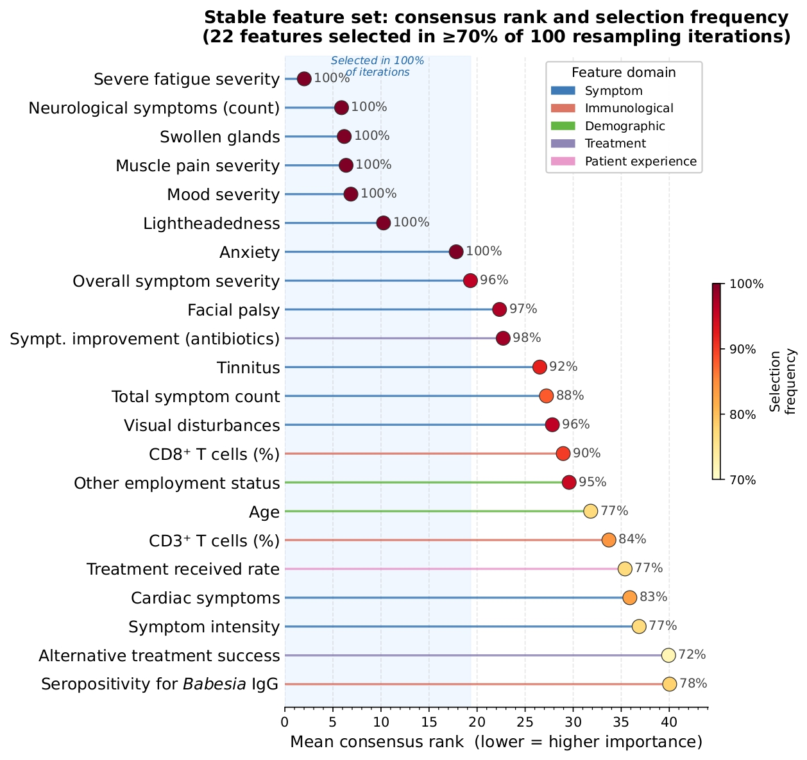

# Machine Learning-Driven Biomarker Discovery for Stratifying Treatment Response in Tick-Borne Illness

## Abstract

Lyme disease and related tick-borne infections can cause persistent symptoms even after antibiotic treatment. Currently, clinicians cannot reliably predict which patients will respond well to therapy. We analysed clinical and laboratory data from 301 patients collected before treatment. By systematically evaluating 149 patient characteristics across 100 repeated analyses using multiple methods (over 700,000 evaluations), we identified 22 features that consistently distinguished responders from non-responders. Patients who responded well tended to report greater physical symptom burden at baseline, whereas non-responders reported better mood and overall well-being. Five features were consistently identified across all analytical approaches. These findings suggest that baseline symptom and immune profiles may help identify patients more likely to benefit from treatment and support more informed clinical decision-making.

> **Repository running name:** Stable-MultiMethod-Features-TBI

---

## Table of Contents

1. [Introduction](#introduction)
2. [Pipeline Overview](#pipeline-overview)
3. [Data](#data)
4. [Repository Structure](#repository-structure)
5. [Installation](#installation)
6. [Usage](#usage)
7. [Results](#results)
8. [Key Contributions](#key-contributions)
9. [Reproducibility](#reproducibility)
10. [Licenses](#licenses)
11. [Feedback](#feedback)
12. [References](#references)
13. [Citation](#citation)

---

## Introduction

Tick-borne illnesses, particularly those caused by *Borrelia* species, are increasing globally in both incidence and geographic range. A significant subset of patients develop persistent symptoms after standard antibiotic treatment, a condition variously referred to as Post-Treatment Lyme Disease Syndrome (PTLDS) or Chronic Lyme Disease (CLD). This heterogeneity in treatment response poses a major clinical challenge: there are currently no reliable tools to identify, before treatment begins, which patients are likely to benefit from therapy.

Machine learning models applied to clinical datasets offer a potential path forward, but they frequently suffer from instability and poor reproducibility — particularly in small, heterogeneous cohorts. Feature selection results often vary substantially depending on the algorithm used, the random seed chosen, or minor changes in the training data.

This repository implements a **stability-aware machine learning framework** designed to address these limitations by identifying baseline predictors of treatment response that are robust across methods and data splits, reduce dependence on specific algorithms or random samples, and improve reproducibility of biomarker discovery in clinical ML.

The approach combines multi-method feature selection, consensus ranking, and rigorous cross-validation to extract stable, clinically interpretable biomarkers from a cohort of 301 tick-borne illness patients.

---

## Pipeline Overview

The full workflow includes:

1. Data preprocessing (imputation, scaling)
2. Patient stratification (high vs. non-responders)
3. Multi-method feature selection
4. Stability-based feature aggregation
5. Model training (Random Forest, SVM, Logistic Regression, KNN)
6. Performance evaluation with cross-validation



---

## Data

Due to privacy and ethical restrictions associated with clinical data, the full original dataset is not publicly released. The dataset used in this study contains 301 patients with tick-borne illness and covers 149 baseline variables collected before treatment. Below is a description of the variable categories included.

### Variable Categories

**Demographic and clinical**
- `Age`: Patient age at baseline
- `Gender`: Patient sex (F / M)
- `Disease duration`: Time since symptom onset

**Symptom and quality-of-life scores**
- Physical symptom burden scales (fatigue, pain, cognitive impairment)
- Mood and well-being assessments
- Overall health status indices

**Immune and haematological markers**
- `CD3%`: T lymphocyte percentage — reference range 61–84%
- `CD3 Total`: Total T lymphocyte count — reference range 960–2600 cells/µL
- `CD4%`: Helper T cell percentage — reference range 32–60%
- `CD4-Helper`: CD4+ Helper T cell count — reference range 540–1600 cells/µL
- `CD8%`: Cytotoxic T cell percentage — reference range 13–40%
- `CD8-Suppr`: CD8 suppressor count — reference range 270–930 cells/µL
- `H/S ratio`: Helper/suppressor ratio — reference range 0.9–4.5
- `NK cells`: Natural killer cell count
- `B cells`: CD19+ B lymphocyte count

**Routine blood tests**
- `HgB`: Haemoglobin — reference range 11.5–16.5 g/dL
- `Platelets`: Platelet count — reference range 150–400 ×10⁹/L
- `Neutrophils`: Neutrophil count — reference range 2–8 ×10⁹/L
- `Lymphocytes`: Lymphocyte count — reference range 1–4 ×10⁹/L
- `WCC`: White cell count — reference range 3.5–11 ×10⁹/L
- `CRP`: C-reactive protein — reference range <7 mg/L

**Iron and protein metabolism**
- `Iron`: Serum iron — reference range 6–33 µmol/L
- `Transf`: Transferrin — reference range 1.88–3.02 g/dL
- `%Trans sat`: Transferrin saturation — reference range 19–55%

### Preprocessing

- Missing values handled via imputation
- Feature standardisation applied prior to modelling
- Outcome variable: treatment response classification (high vs. non-responder) derived from post-treatment symptom change

All data have been fully anonymised and contain no personally identifiable information.

---

## Repository Structure

```
.
├── dataset/            # Anonymised dataset (where applicable)
├── src/                # Core pipeline scripts
├── figures/            # Figures used in README and paper
├── requirements.txt    # Python dependencies
├── LICENSE
└── README.md
```

---

## Installation

Clone the repository:

```bash
git clone https://github.com/tciavattini/Stable-MultiMethod-Features-TBI.git
cd Stable-MultiMethod-Features-TBI
```

Install dependencies:

```bash
pip install -r requirements.txt
```

Python 3.10 is recommended. It is advised to use a dedicated virtual environment:

```bash
python -m venv venv
source venv/bin/activate        # macOS / Linux
venv\Scripts\activate           # Windows
pip install -r requirements.txt
```

---

## Usage

The analysis pipeline is organised into sequential scripts. Run them in the following order:

**Step 1 — Feature engineering**
```bash
src/01_feature_engineering_pipeline.ipynb
```
Handles raw data ingestion, imputation, scaling, and outcome variable derivation.

**Step 2 — Outcome classification**
```bash
python src/02_outcome_classification.py
```
Stratifies patients into high-responder and non-responder groups based on treatment outcome.

**Step 3 — Data preparation**
```bash
python src/03_prepare_data.py
```
Prepares train/test splits and formatted input arrays for downstream modelling.

**Step 4 — Sanity check**
```bash
python src/sanity_check.py
```
Validates data integrity and class balance before running the main analysis.

**Step 5 — Stability analysis (main)**
```bash
python src/04_stability_top30.py
```
Runs 100 repeated analyses across multiple feature selection methods (~700,000 evaluations). To run in background:
```bash
nohup python src/04_stability_top30.py > logs/stability_run_$(date +%Y%m%d_%H%M).log 2>&1 &
echo $! > logs/stability.pid
```

**Step 6 — Multi-feature consensus**
```bash
python src/05_multifeature.py
```
Aggregates feature rankings across methods to identify stable consensus features.

**Step 7 — Alternative feature selection**
```bash
python src/06_alt_feature_selection.py
python src/07_alt_fs_classification.py
```
Compares stability results against alternative feature selection strategies.

**Step 8 — Phenotype analysis**
```bash
python src/08_phenotype_analysis.py
```
Characterises clinical phenotypes associated with stable feature subsets.

**Step 9 — Sensitivity analyses**
```bash
python src/09_sensitivity_analyses.py
```
Evaluates robustness of findings under alternative modelling assumptions.

All experiments are executed with fixed random seeds to ensure full reproducibility.

---

## Results

### Stable Feature Identification

Across 100 repeated analyses and multiple feature selection methods, 22 features were consistently identified as distinguishing high-responders from non-responders. Five features were selected across all analytical approaches regardless of algorithm or data split. Patients who responded well to treatment tended to show greater physical symptom burden at baseline, while non-responders reported better mood and overall well-being at the start of treatment.



### Model Performance

Predictive performance was evaluated using cross-validation across four classifiers: Random Forest, SVM, Logistic Regression, and KNN. Performance metrics (AUC, accuracy, sensitivity, specificity) are reported for each classifier and for the consensus feature subset.

---

## Key Contributions

- Stability-aware feature selection framework for clinical ML in heterogeneous cohorts
- Multi-method consensus ranking strategy to reduce algorithm dependence
- Robust identification of reproducible baseline biomarkers for treatment response prediction
- Fully reproducible pipeline aligned with TRIPOD+AI reporting principles

---

## Reproducibility

- Python version: 3.10
- Fixed random seeds for all stochastic processes
- Deterministic pipeline execution order
- Full code and environment specification provided via `requirements.txt`

---

## Licenses

- **Code**: MIT License — see `MIT license` file for details
- **Dataset**: Creative Commons BY-SA 4.0 — see `CC-BY-SA-4.0 license` file for details

---

## Feedback

We welcome questions, suggestions, and contributions. Please open an issue on GitHub if you encounter any problems with the repository or would like to discuss the methodology.

---

## References

1. Xi, D.; Garg, K.; Lambert, J.S.; Rajput-Ray, M.; Madigan, A.; Avramovic, G.; Gilbert, L. Scrutinizing Clinical Biomarkers in a Large Cohort of Patients with Lyme Disease and Other Tick-Borne Infections. *Microorganisms* 2024, 12, 380. https://doi.org/10.3390/microorganisms12020380

2. Xi, D.; Thoma, A.; Rajput-Ray, M.; Madigan, A.; Avramovic, G.; Garg, K.; Gilbert, L.; Lambert, J.S. A Longitudinal Study of a Large Clinical Cohort of Patients with Lyme Disease and Tick-Borne Co-Infections Treated with Combination Antibiotics. *Microorganisms* 2023, 11, 2152. https://doi.org/10.3390/microorganisms11092152

3. Garg, K.; Thoma, A.; Avramovic, G.; Gilbert, L.; Shawky, M.; Ray, M.R.; Lambert, J.S. Biomarker-Based Analysis of Pain in Patients with Tick-Borne Infections before and after Antibiotic Treatment. *Antibiotics* 2024, 13, 693. https://doi.org/10.3390/antibiotics13080693

---

## Citation

If you use this repository, please cite the associated manuscript:

> Ciavattini T, et al. *Stability-aware machine learning identifies reproducible baseline predictors of treatment response in tick-borne illness.* Manuscript under submission.

```bibtex
@misc{Stable-MultiMethod-Features-TBI,
  author    = {Teresa Ciavattini},
  title     = {Machine Learning-Driven Biomarker Discovery for Stratifying Treatment Response in Tick-Borne Illness},
  year      = {2025},
  publisher = {GitHub},
  journal   = {GitHub repository},
  howpublished = {\url{https://github.com/tciavattini/Stable-MultiMethod-Features-TBI}},
}
```

---

**Teresa Ciavattini**
Sorbonne Université / SCAI – Sorbonne Center for Artificial Intelligence
Université de Technologie de Compiègne
